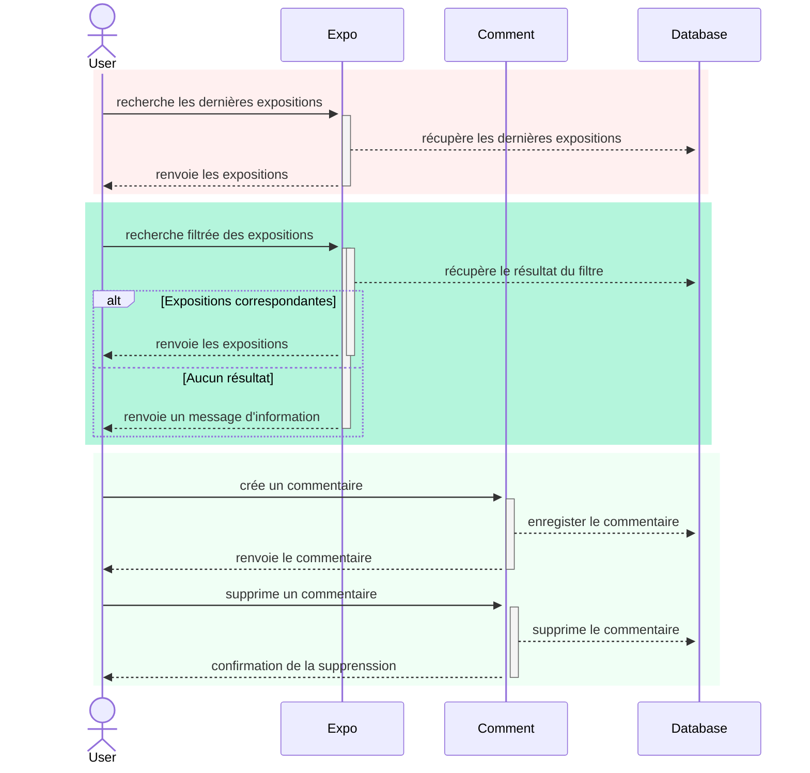
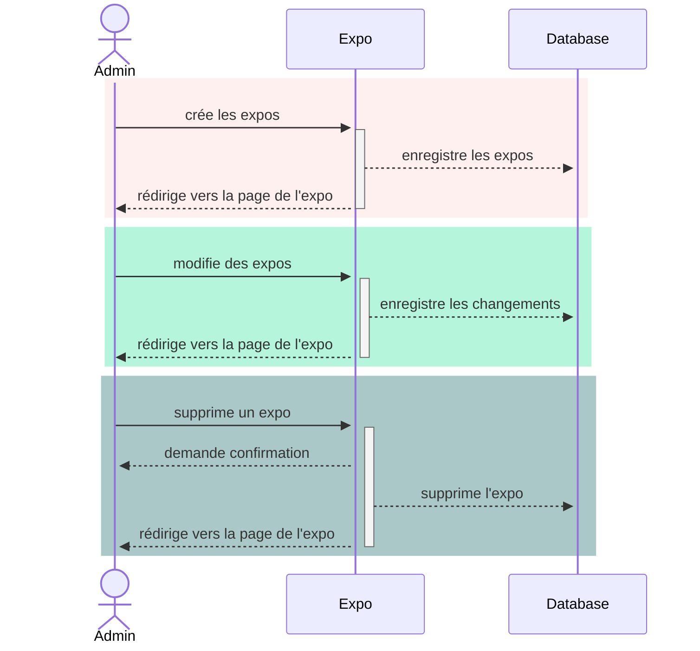

# Diagrammes de séquences

Répresentation des séquences de l'application ExpoApp.

```mermaid

sequenceDiagram
    actor User
    participant Expo
    participant Comment
    participant Database

    rect rgb(255,240,240)
        User->>+Expo: recherche les dernières expositions 
        activate Expo
        Expo-->>+Database: récupère les dernières expositions
        Expo-->>-User: renvoie les expositions
    end

    rect rgb(180,245,220)
        User->>+Expo: recherche filtrée des expositions 
        activate Expo
        Expo-->>+Database: récupère le résultat du filtre
        alt Expositions correspondantes
            Expo-->>-User: renvoie les expositions
        else Aucun résultat
            Expo-->>-User: renvoie un message d'information
        end
    end

    rect rgb(240,255,245)
        User->>+Comment: crée un commentaire
        activate Comment
        Comment-->>+Database: enregister le commentaire
        Comment-->>-User: renvoie le commentaire

        User->>+Comment: supprime un commentaire
        activate Comment
        Comment-->>+Database: supprime le commentaire
        Comment-->>-User: confirmation de la supprenssion
    end
```

# Diagrammes d'admin

```mermaid

sequenceDiagram
    actor Admin
    participant Expo
    participant Database

    rect rgb(255,240,240)
        Admin->>+Expo: crée les expos 
        activate Expo
        Expo-->>+Database: enregistre les expos
        Expo-->>-Admin: rédirige vers la page de l'expo
    end  

    rect rgb(180,245,220)
        Admin->>+Expo: modifie des expos 
        activate Expo
        Expo-->>+Database: enregistre les changements
        Expo-->>-Admin: rédirige vers la page de l'expo
    end  

    rect rgb(170,200,200)
        Admin->>+Expo: supprime un expo
        activate Expo
        Expo-->>+Admin: demande confirmation

        Expo-->>+Database: supprime l'expo
        Expo-->>-Admin: rédirige vers la page de l'expo
    end 
```